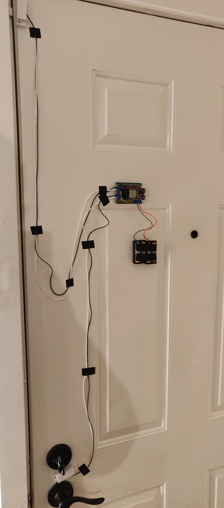
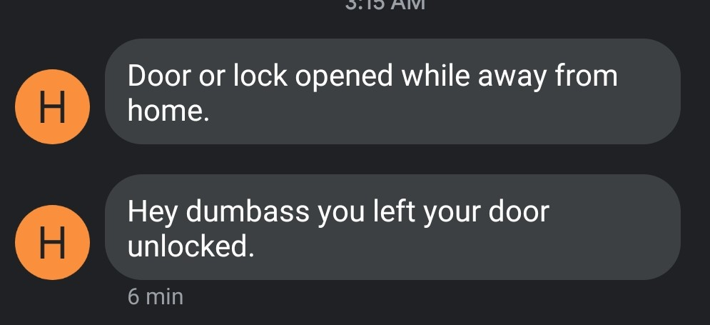
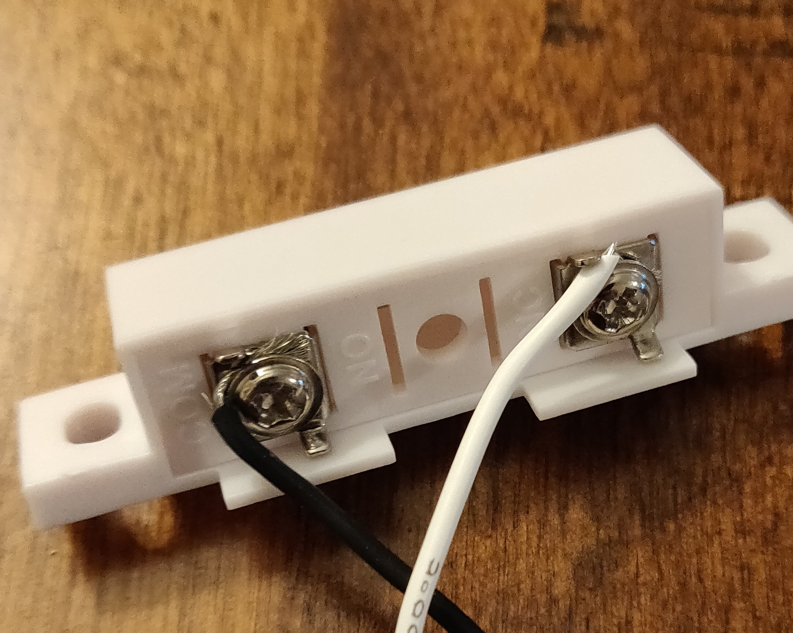
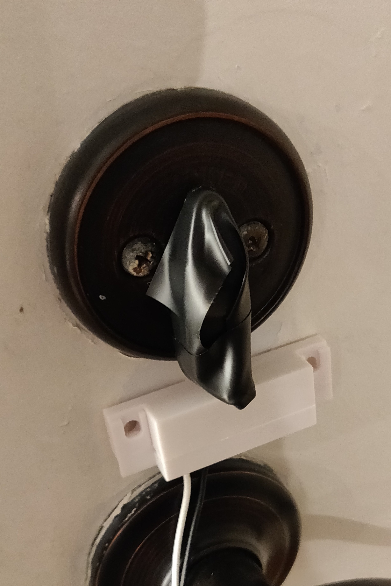
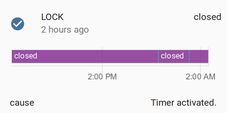
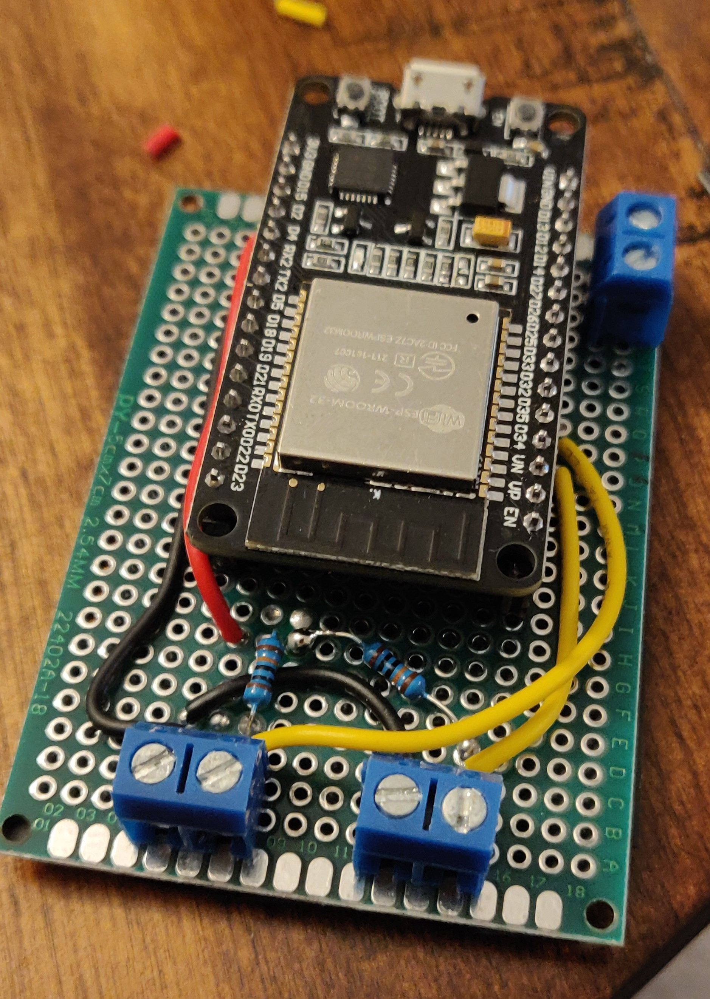
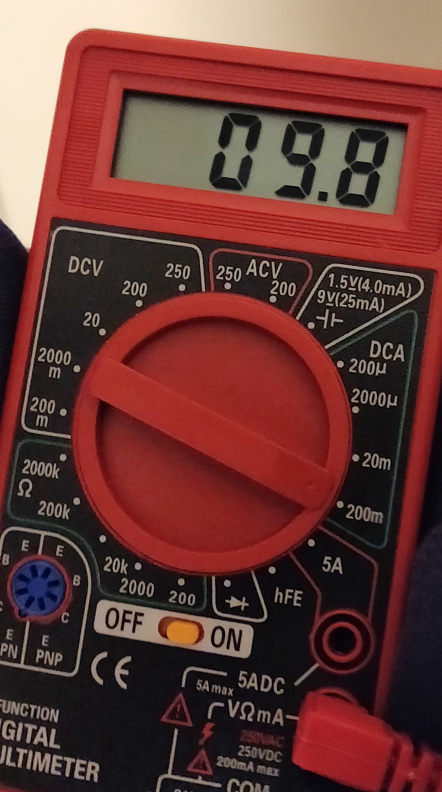

# door-monitor

An IOT solution to forgetting to lock the door using an ESP32 and a Flask
server. Integrates with Home Assistant and Discord to provide instant
notification of the locked or unlocked state of the door lock and the state
of the door being open.



Using Home Assistant and Twilio, I can text myself when I leave the
house without locking:



## Description

This uses an ESP32 dev board connected to two reed switches, one placed on the
door frame, one on the door lock. Hourly, and when the state of the lock or
door sensors are set to "open",
the board will log to the Flask server that collects this data.



The included magnets to pair with the reed switches I bought were too big
to fit where I needed them, so I used stronger, smaller magnets that
I taped to the lock and the door frame.



The data sent from the ESP32 to the Flask server gets forwarded
along to each of the configured webhooks. This can be configured
using the webserver.


This integrates with Home Assistant very well.



Using the ESP32's "deep sleep" mode and pin interrupts,
the ESP32 is able to run using very little power.



While the ESP32 is very light on power, the dev board that I'm using
is not.
Even with the power LED removed,
the board was measured to run at 9.8mA in deep sleep mode.
Most of the current
draw is from the USB Controller and voltage regulator.



Running on 4 AA batteries in series (2000-3000 mAh),
the sensor is estimated to run for roughly 200-300 hours.
While this is _okay_, it's not great.
In the future I may change to a more "barebones" solution
that does not include this unnecessary power draw.

## Running the Flask Server

The Flask server runs using Docker. The `uwsgi-nginx-flask`
[image must be built manually if running on a Raspberry Pi.](https://github.com/tiangolo/uwsgi-nginx-flask-docker/issues/67)

When debugging, the server can be started using:

```console
./start_docker_debug.sh
```

When deployed, the server can be started using:

```console
./start_docker.sh
```

## Uploading the sensor-client

The sensor-client is built using Arduino. Ensure that the ESP32 board is
installed.
The Arduino extension for VS Code can upload this sketch.

Modify `config.h` with the wifi settings, URL of the server,
and the pins and names of each of the sensors.

```cpp
#define WIFI_SSID "wifi ssid"
#define WIFI_PSK  "psk"

#define REPORTING_URL "http://10.1.1.2/api/sensor"

// define the sensors
Sensor sensors[] = {
    // pin must be one of 0,2,4,12-15,25-27,32-39
    // those support interrupts while in deep sleep
    // { pin, name of sensor }
    { 32, "LOCK" },
    { 33, "DOOR" },
};

#define NUM_SENSORS 2
```
